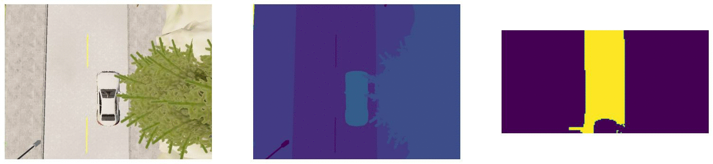

# README

This repo used CARLA 0.9.13

## Run

Maybe you have to export the Vulkan environment variable if you get a X11 error. Be aware.

```
export VK_ICD_FILENAMES="/usr/share/vulkan/icd.d/nvidia_icd.json"
```

Start server.

```
/opt/carla-simulator/CarlaUE4.sh  -quality-level=Low
```

Instantiate Town02 on the CARLA server and generate trafic. Go to `/opt/carla-simulator/PythonAPI/`
``` 
python util/config.py --map Town02

python examples/generate_traffic.py
```

Now, in the directory one-top level of this repo, run it as module.
```
python -m aes2_interfaces.carla.main
```

You'll see a window like below:


## References
+ Python interfaces: 
  + https://tomisin.dev/blog/how-to-implement-an-interface-in-python
  + https://realpython.com/python-interface/

